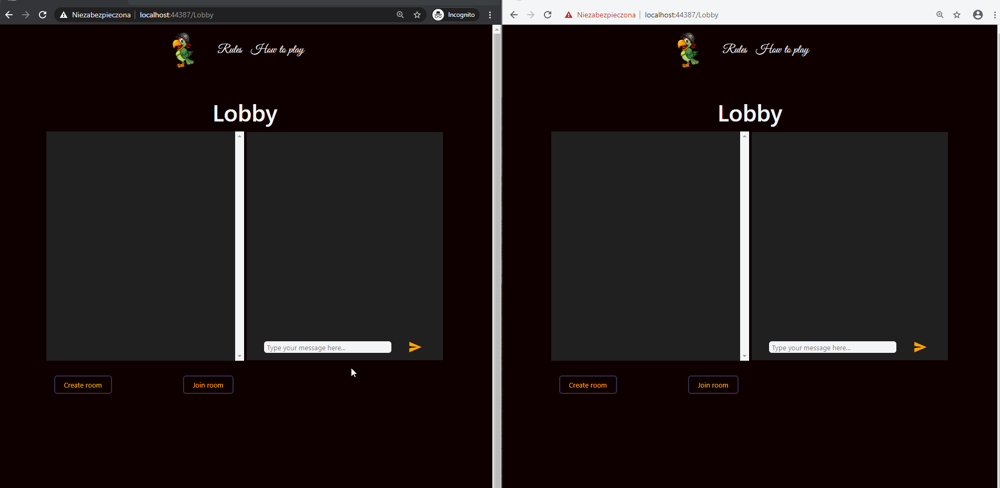
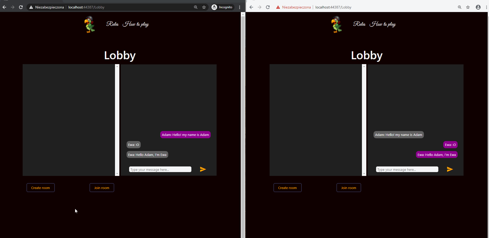
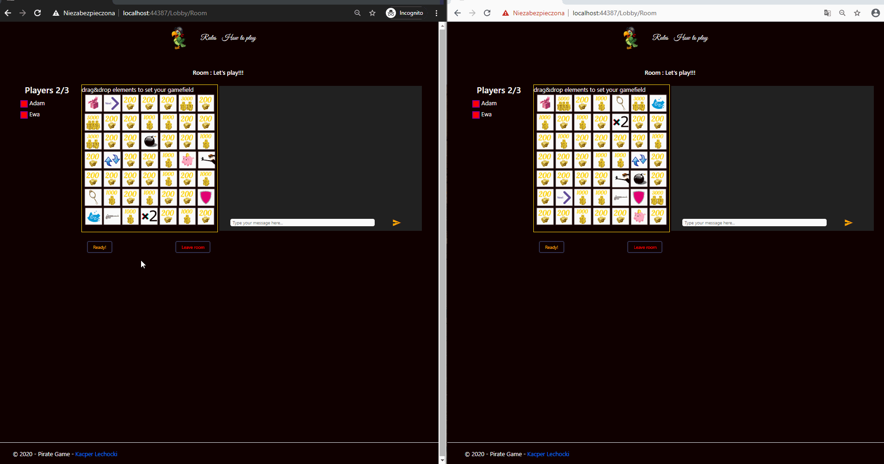
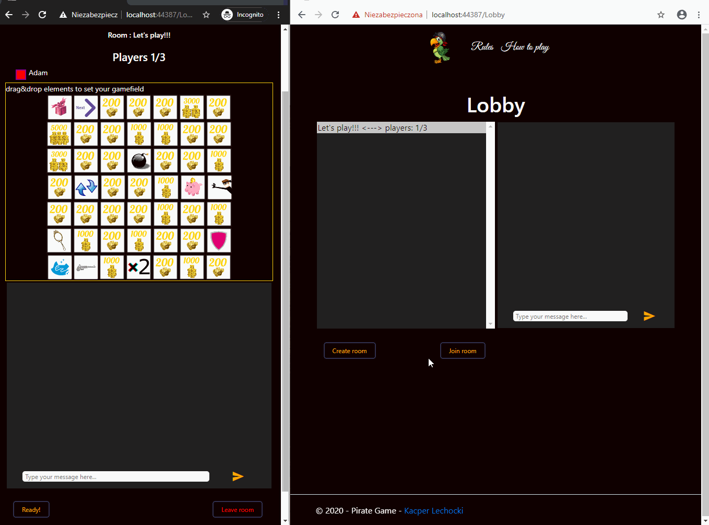
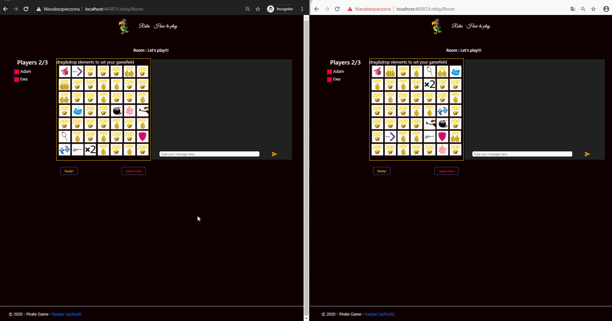

# PirateGame_MVC
Main features:
 * multi users realtime chat
 * multi users lobby - allows to create and join rooms
 * drag & drop field setting 

 Main technologies:
 * SignalR
 * Asp.net Core
 * javascript

## Chat

 There are both all-players and group real-time chats. 

## Lobby
 

 The place where all players can chat together, create and select the room 

###  &bull; creating room

 Created room instantly appears in lobby

 

### &bull; setting gamefields

### &bull; joining and leaving the room

 

### &bull; getting ready

Each player in the room needs to mark himself ready to start the game. Until that happens the game cannot be started 

